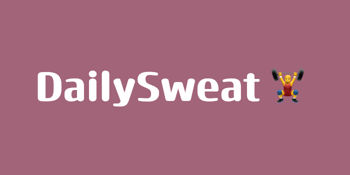

## What the project does

DailySweat is a fictional company that is created for people that are looking to improve their health with recommended workouts and other incentives to get you to where you desire
to be. The project uses react router to create routes that display a detailed description about the specific workout as well as a gif that indicates how the workout should be done in the correct form.

## How to get started

After choosing the directory to clone the repo, copy and paste the command into the terminal

```
git clone https://github.com/Nelso22/dailysweat.git

```

To run the Project

```
npm run dev
```

## Built with

[](https://skillicons.dev)

### Demo

[Link](https://dailysweat-ais0k6le2-nelso22s-projects.vercel.app)
